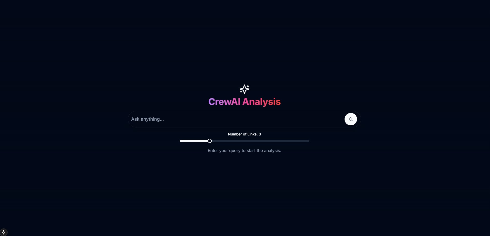

# Project

**CrewAI** is an Agentic Framework that is gaining popularity. In this demo, I use it in conjunction with a Django backend with advanced research tooling and a Next.js frontend.
This repository demonstrates a multi-agent approach to web search, analysis, and final synthesis, built with custom CrewAI agents.

---

## Table of Contents

1. [Video Demo](#video-demo)
2. [Repository Structure](#repository-structure)
3. [Setup and Installation](#setup-and-installation)
   1. [Local Environment](#local-environment)
   2. [Docker](#docker)
4. [Backend and Frontend](#backend-and-frontend)
   1. [Backend: Python/Django](#backend-pythondjango)
   2. [Frontend: Next.js/React](#frontend-nextjsreact)
5. [How to Run the Project](#how-to-run-the-project)
6. [Deployment Options](#deployment-options)
7. [Detailed Walkthrough](#detailed-walkthrough)

---

## Video Demo

[](https://github.com/user-attachments/assets/d59b82e5-2ec1-40cf-a522-e8cbc57e7877)

---

## Repository Structure

```plaintext
crewai-demo/
├── README.md
├── docker-compose.yml
├── requirements-dev.txt
├── requirements.txt
├── stored_output.txt
├── .pre-commit-config.yaml
├── backend/
│   ├── Dockerfile                # Docker instructions for the Django backend
│   ├── MANIFEST.in
│   ├── db.sqlite3                # Local dev database (SQLite)
│   ├── manage.py
│   ├── pyproject.toml            # Main Python dependencies
│   ├── pytest.ini
│   ├── setup.cfg
│   ├── app/                      # Main Django app code
│   ├── crewai_backend/           # Django project code
│   ├── crewai_config/            # CrewAI agent/task definitions
│   └── tests/                    # Pytest-based unit tests
├── frontend/
│   ├── Dockerfile                # Docker instructions for the Next.js frontend
│   ├── package.json
│   ├── tsconfig.json
│   ├── app/                      # Next.js 18+ (App Router)
│   ├── components/
│   ├── public/
│   └── ... etc.
├── video_demo/
├── .chroma-local/
├── .devcontainer/                # Dev container config
└── .github/workflows/            # GitHub Actions (CI/CD)
```


## Setup and Installation

Below are instructions to run this repository either **locally** (using Python & Node) or via **Docker**.

### Local Environment

1. **Clone the Repository**:

    ```bash
    git clone https://github.com/abdulzedan/crewai-demo.git
    ```

2. **Python & Node.js**:

    * Ensure you have **Python 3.11** (or higher) and **Node.js 18+** installed.

    * Set up a Python virtual environment:

        ```bash
        python -m venv venv
        source venv/bin/activate    # Linux/macOS
        # or .\venv\Scripts\activate # Windows
        ```

3. **Install Python Dependencies**:

    From the **project root**, install dev requirements, then install the backend in editable mode:

    ```bash
    pip install -r requirements-dev.txt
    pip install -e ./backend
    ```

4. **Install Node.js Dependencies** (inside `frontend/`):

    ```bash
    cd frontend
    npm install
    cd ..
    ```

5. **Environment Variables**:

    * Create a `.env` file in the project root (same level as `docker-compose.yml`) to store your secrets (e.g., `AZURE_API_KEY`, `SERPER_API_KEY`, etc.).

    * Minimal example:

        ```bash
        AZURE_API_KEY=
        AZURE_API_BASE=
        AZURE_API_VERSION=
        AZURE_DEPLOYMENT_NAME=

        # For embeddings
        AZURE_OPENAI_EMBEDDING_MODEL=
        AZURE_EMBEDDING_DEPLOYMENT=

        # For backend and external APIs
        SERPER_API_KEY=[serper_key](https://serper.dev/signup)
        DJANGO_SECRET_KEY= [some_django_secret](https://djecrety.ir/)

        DEBUG=True
        ```


### Docker

You can also run both backend and frontend via Docker Compose.

1. **Create a `.env`** in the project root, as above. Docker Compose automatically loads variables from this `.env`.

2. **Build & Start** everything:

    ```bash
    docker-compose up --build
    ```

    This starts:

    * **`crewai_backend`** (on port `8000`)
    * **`crewai_frontend`** (on port `3000`)
    * **`crewai_chromadb`** (on port `8002`, using the `chroma-data` volume)
3. Access the app:

    * Backend at [http://localhost:8000](http://localhost:8000)
    * Frontend at [http://localhost:3000](http://localhost:3000)

> **Note**: The Docker setup automatically runs migrations, then starts the Django dev server and Next.js dev server.


## Backend and Frontend

### Backend (Python/Django)

* **Location**: [`backend/`](./backend)
* Built with **Django**, plus the following major Python libraries:
    * **CrewAI** for agent-based orchestration
    * **LangChain** ecosystem (`langchain`, `langchain-openai`, `langchain-chroma`, etc.)
    * **Celery** (optional usage in `task_status_router.py`)
    * **Chroma** for local vector database
    * **OpenAI** / Azure for LLM embeddings
    * **REST** framework via `djangorestframework` & `drf-spectacular`

**Key commands**:

```bash
# from project root
pip install -e ./backend

# run migrations & dev server
cd backend
python manage.py migrate
python manage.py runserver
```


### Frontend (Next.js/React)

* **Location**: [`frontend/`](./frontend)
* **Next.js** 15+ with the App Router
* `tailwindcss` for styling
* A variety of React-based UI libraries (Radix, ShadCN/ui, etc.)

**Key commands**:

```bash
cd frontend
npm install
npm run dev
```

> By default, it runs on [http://localhost:3000](http://localhost:3000).


## How to Run the Project

Below is a **typical** local dev workflow without Docker:

1. **Terminal 1** (Backend)

    ```bash
    # in project root (after installing python deps)
    cd backend
    python manage.py migrate
    python manage.py runserver 0.0.0.0:8000
    ```

2. **Terminal 2** (Frontend)

    ```bash
    cd frontend
    npm run dev
    ```

3. Visit [http://localhost:3000](http://localhost:3000) to access the Next.js UI. The backend will respond at [http://localhost:8000](http://localhost:8000).

**Or** simply:

```bash
docker-compose up --build
```

* * *

## Deployment Options

Depending on your hosting:

* **Docker**: You already have `docker-compose.yml`. For production, you may wish to:
    * Switch Next.js to a production build (`npm run build && npm run start`).
    * Use a process manager (e.g., `gunicorn`) for Django in a more production-like config.
* **Cloud VMs**: Provision a VM, install Docker, run `docker-compose up`.
* **PaaS**: Deploy backend and frontend separately (or together if your PaaS supports Docker Compose)

* * *

## Detailed Walkthrough

1. **Home Page** (`/`):

    * Presents a large search bar for user queries.
    * Allows specifying the number of links to gather from external search.
2. **Submitting a Query**:

    * The Next.js frontend calls `/api/analysis/route.ts`, which proxies to the Django endpoint (`/api/analysis/`).
    * The backend orchestrates an AI “Crew” workflow:
        * **Research Task** (uses `AISearchTool` + Serper API).
        * **Aggregate Task** (aggregates data into markdown).
        * **Store Task** (optionally saves summary into Chroma DB).
        * **Synthesize Task** (final markdown-based answer).
3. **Real-Time Logs**:

    * The “Agent Workflow” card in the UI shows internal steps from the CrewAI logs.
4. **Final Analysis**:

    * Renders a confidence score and final markdown content in the UI. The confidence score is static for demo purposes.
    * The user can copy or clear the final result.
